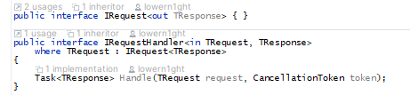
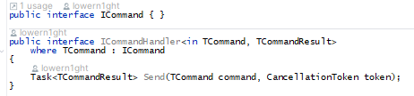

# Garther

---

Production ready application forum on microservice architecture
using approaches 12 factor application, DDD, CQRS, MsQ

## UML Design

> This example is an application architecture plan with no explicit
> dependencies except for the ElasticSearch engine


> Visual data model in the application


## Implementations

- Main database forum models => **PostgreSQL**
- Search Engine => **ElasticSearch**
- REST Server realization on => **ASP.NET Core**
    - with _ORM_ **EF Core 7**
- ApiGateway => **Ocelot.NET**
- IdentityService => ASP.NET Identity With OpenID => **in progress**
- Message broker => RabbitMQ

## Features

### CQRS

The project uses the CQRS architectural pattern with its own implementation

1. RequestHandler



2. CommandHandler



## Getting Start

1. Copy git repo to local machine

``` bash
  git clone https://lowern1ght/Garther && cd Garther/deploy
```

2. setup configuration file in _/deploy_ directory


3. Execute docker-compose command to build and up project

```bash
docker-compose buid && docker-compose up -d
```