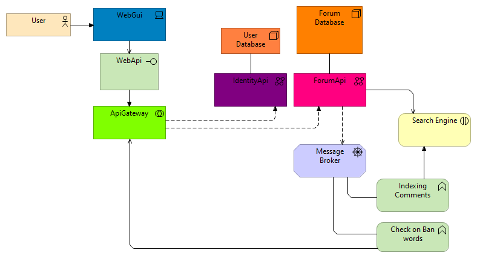

# Garther

---

Production ready application forum on microservice architecture
using approaches 12 factor application, DDD

## UML Design

> This example is an application architecture plan with no explicit
> dependencies except for the ElasticSearch engine

> Visual data model in the application

## Implementations

- Main database forum models => **PostgreSQL**
- Search Engine => **ElasticSearch**
- REST Server realization on => **ASP.NET Core**
    - with _ORM_ **EF Core 7**
- ApiGateway => **Ocelot.NET**
- IdentityService => ASP.NET Identity With OpenID => **in progress**
- Message broker => RabbitMQ

## Features

...in progress

## Getting Start

...in progress